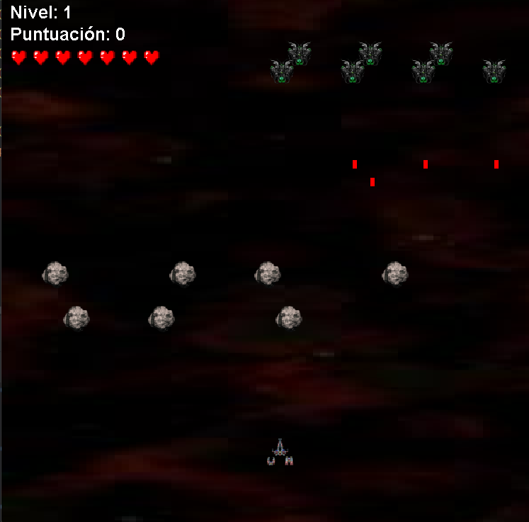
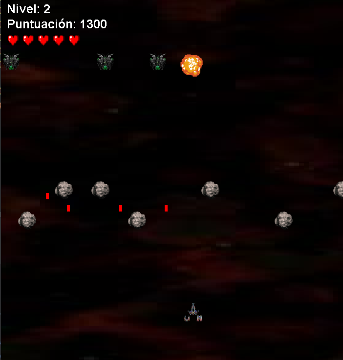
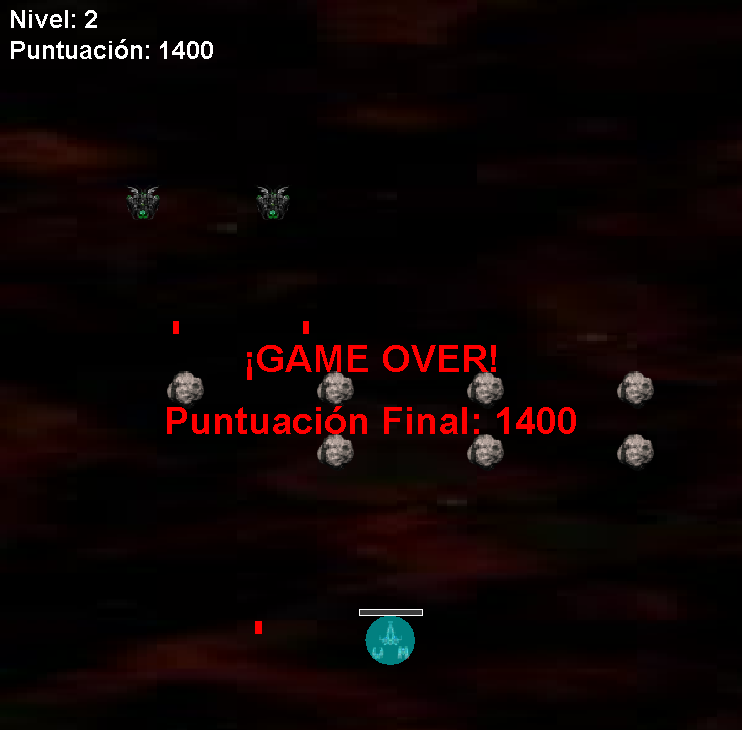

# NavyFax

Un juego arcade estilo Space Invaders desarrollado en Java usando Swing y programación concurrente con múltiples hilos.

## Acerca del proyecto

NavyFax es un shooter arcade 2D donde el jugador controla una nave espacial y debe eliminar oleadas de enemigos antes de que lleguen a la parte inferior de la pantalla. El juego cuenta con un menú principal, sistema de dificultad seleccionable, cuatro tipos de enemigos (incluyendo un Boss cada 5 niveles), power-ups coleccionables y un completo sistema de efectos visuales y de sonido.

## Capturas de pantalla





## Jugabilidad

- Elige tu dificultad en el menú principal antes de empezar
- Mueve tu nave a izquierda y derecha para esquivar disparos enemigos
- Dispara a los enemigos para ganar puntos — matar en sucesión rápida activa el multiplicador de combo
- Los obstáculos bloquean tus disparos — úsalos para cubrirte de balas enemigas
- Recoge los power-ups que dejan caer los enemigos al morir
- Después de recibir daño se activa un escudo temporal con barra de duración visible
- Elimina a todos los enemigos para completar el nivel y avanzar al siguiente
- El juego guarda automáticamente tu puntuación en el top 10 al terminar

### Controles

| Tecla       | Acción          |
|-------------|-----------------|
| `←` `→`    | Mover nave      |
| `Espacio`   | Disparar        |
| `ESC`       | Pausar / Reanudar |

## Características

### Sistemas principales
- **Menú principal** — pantalla animada con campo de estrellas, selector de dificultad y tabla de mejores puntuaciones
- **Top 10 persistente** — las puntuaciones se guardan en disco y se muestran entre partidas
- **Pausa completa** — `ESC` pausa el juego y la música; también se activa automáticamente al perder el foco de la ventana
- **Pantalla entre niveles** — overlay de "¡Nivel X Completado!" con auto-avance tras 2.5 segundos
- **Reinicio sin cerrar** — al recibir Game Over se puede reintentar o volver al menú sin reiniciar la aplicación

### Dificultad
| Modo     | Velocidad enemigos | Frecuencia de disparos | Vidas |
|----------|--------------------|------------------------|-------|
| Fácil    | ×0.65              | ×0.5                   | 12    |
| Normal   | ×1.0               | ×1.0                   | 10    |
| Difícil  | ×1.45              | ×1.6                   | 7     |

### Enemigos
| Tipo      | Aparece desde | HP | Tamaño | Comportamiento | Puntos |
|-----------|---------------|----|--------|----------------|--------|
| Normal    | Nivel 1       | 1  | 30×30  | Formación sincronizada (estilo Space Invaders) | 100 |
| Rápido    | Nivel 2       | 1  | 20×20  | Movimiento zigzag sinusoidal independiente | 150 |
| Tanque    | Nivel 4       | 3  | 45×45  | Formación lenta, barra de vida visible | 250 |
| Boss      | Nivel 5, 10…  | Escala con nivel | 60×60 | Movimiento propio, barra de salud en pantalla | 500 |

### Power-ups
Los power-ups caen de los enemigos al morir (25% de probabilidad):

| Icono | Efecto | Duración |
|-------|--------|----------|
| `x2` | Disparo doble | 10 s |
| `SC` | Escudo completo inmediato | — |
| `VL` | Velocidad de disparo ×2.5 | 8 s |

### Efectos visuales
- **Parallax scrolling** — fondo con scroll continuo + dos capas de estrellas a distintas velocidades
- **Explosiones programáticas** — flash inicial, bola de fuego expansiva y anillo de humo (sin sprites externos)
- **Screen shake** — la pantalla tiembla al recibir daño
- **Flash rojo** — destello de daño semitransparente
- **Números flotantes** — `+100`, `+500×3`… aparecen en el punto de eliminación y ascienden desvaneciéndose

### HUD
- Barra de vida gráfica con color dinámico (verde → naranja → rojo)
- Barra de recarga junto a la nave (se llena mientras el disparo está en cooldown)
- Multiplicador de combo (`x2`, `x3`… hasta `x8`) en la parte superior al matar en sucesión
- Indicadores de power-ups activos con tiempo restante implícito
- Badge de dificultad en esquina superior derecha
- Barra de salud del Boss en la parte inferior de la pantalla

## Arquitectura

El proyecto sigue el patrón **MVC (Modelo-Vista-Controlador)**:

```text
src/
├── controlador/
│   └── JuegoControlador.java               # Máquina de estados, teclado, ventana
├── modelo/
│   ├── Juego.java                          # Estado central del juego
│   ├── Dificultad.java                     # Enum de modos de dificultad
│   ├── Nave.java                           # Jugador (movimiento, escudo, tipo de disparo)
│   ├── Enemigo.java                        # Entidad base con sistema de salud
│   ├── EnemigoRapido.java                  # Enemigo veloz con zigzag sinusoidal
│   ├── EnemigoTanque.java                  # Enemigo resistente (3 HP)
│   ├── Boss.java                           # Jefe de nivel (cada 5 niveles)
│   ├── Disparo.java                        # Proyectil del jugador
│   ├── DisparoEnemigo.java                 # Proyectil enemigo
│   ├── Obstaculo.java                      # Obstáculo móvil
│   ├── PowerUp.java                        # Power-up coleccionable
│   ├── GestorPuntuaciones.java             # Persistencia del top 10 en disco
│   ├── SoundManager.java                   # Audio con clips precargados
│   └── threads/
│       ├── MovimientoEnemigosThread.java   # Formación + enemigos independientes
│       ├── MovimientoDisparosThread.java   # Balas del jugador
│       ├── MovimientoDisparosEnemigosThread.java
│       ├── MovimientoObstaculosThread.java
│       ├── MovimientoPowerUpsThread.java   # Power-ups cayendo
│       ├── DisparosEnemigosThread.java     # IA de disparo enemigo
│       ├── DetectorColisionesThread.java   # Colisiones + recogida de power-ups
│       └── ActualizacionEscudoThread.java  # Escudo, tipo de disparo y avance de nivel
└── vista/
    ├── MenuPanel.java                      # Menú principal animado
    └── JuegoPanel.java                     # Renderizado, efectos y overlays
```

### Concurrencia

El juego ejecuta **8 hilos dedicados** simultáneamente:

| Hilo | Responsabilidad | Sleep |
|------|-----------------|-------|
| `MovimientoEnemigosThread` | Mueve la formación como bloque; enemigos independientes individualmente | 20–50 ms |
| `MovimientoDisparosThread` | Mueve balas del jugador hacia arriba | 20 ms |
| `MovimientoDisparosEnemigosThread` | Mueve balas enemigas hacia abajo | 20 ms |
| `MovimientoObstaculosThread` | Oscila obstáculos horizontalmente | 100 ms |
| `MovimientoPowerUpsThread` | Baja power-ups, elimina los que salen de pantalla | 30 ms |
| `DisparosEnemigosThread` | Disparo enemigo aleatorio según nivel y dificultad | 1000 ms |
| `DetectorColisionesThread` | Colisiones bala↔enemigo, bala↔obstáculo, bala↔nave, power-up↔nave | 10 ms |
| `ActualizacionEscudoThread` | Temporizadores de escudo, tipo de disparo y avance de nivel | 100 ms |

Todo el estado compartido usa `CopyOnWriteArrayList` para acceso concurrente sin bloqueos explícitos. Todos los hilos respetan las señales de pausa (`isPausado()`) y de nivel completado (`isNivelCompletado()`).

## Cómo ejecutar

### Desde IntelliJ IDEA
1. Abre el proyecto y configura `src` como source root
2. Ejecuta `controlador/JuegoControlador.java`

### Desde línea de comandos
```bash
# Compilar
javac -d out -sourcepath src src/controlador/JuegoControlador.java

# Copiar recursos
cp -r src/recursos out/

# Ejecutar
java -cp out controlador.JuegoControlador
```

## Tecnologías

- **Lenguaje:** Java (sin dependencias externas)
- **Interfaz gráfica:** Java Swing
- **Concurrencia:** `java.lang.Thread` + `CopyOnWriteArrayList`
- **Audio:** Java Sound API (`javax.sound.sampled`)
- **Persistencia:** I/O estándar (`java.io`)

## Autor

Desarrollado como proyecto personal para practicar concurrencia en Java, patrones de diseño orientados a objetos y fundamentos de desarrollo de videojuegos.
